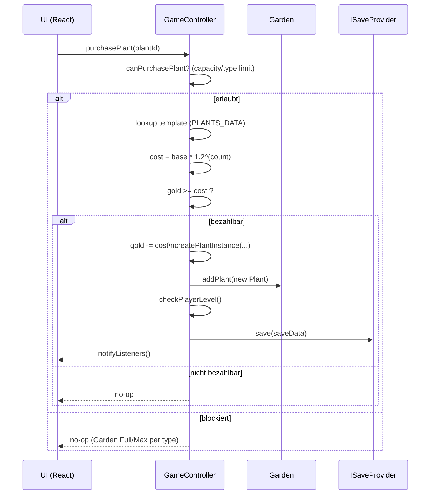

# Sequenzdiagramm – Plant-Kauf (`purchasePlant`)

```mermaid
sequenceDiagram
    participant UI as UI (React)
    participant GC as GameController
    participant GD as Garden
    participant SP as ISaveProvider

    UI->>GC: purchasePlant(plantId)
    GC->>GC: canPurchasePlant? (capacity/type limit)
    alt erlaubt
        GC->>GC: lookup template (PLANTS_DATA)
        GC->>GC: cost = base * 1.2^(count)
        GC->>GC: gold >= cost ?
        alt bezahlbar
            GC->>GC: gold -= cost\ncreatePlantInstance(...)
            GC->>GD: addPlant(new Plant)
            GC->>GC: checkPlayerLevel()
            GC->>SP: save(saveData)
            GC-->>UI: notifyListeners()
        else nicht bezahlbar
            GC-->>UI: no-op
        end
    else blockiert
        GC-->>UI: no-op (Garden Full/Max per type)
    end
```

